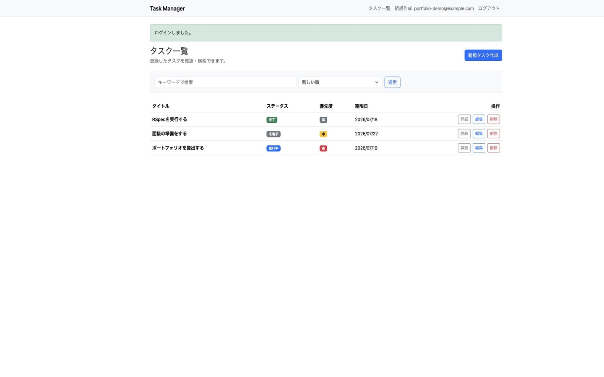
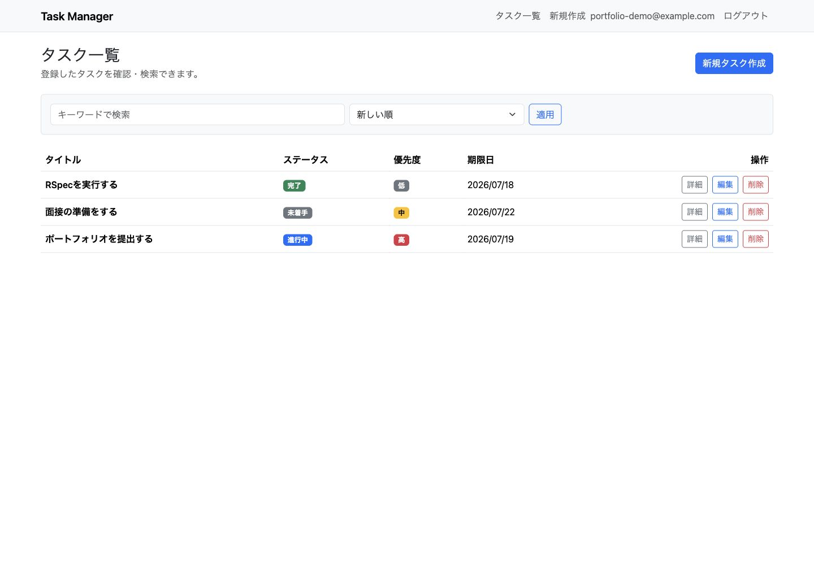
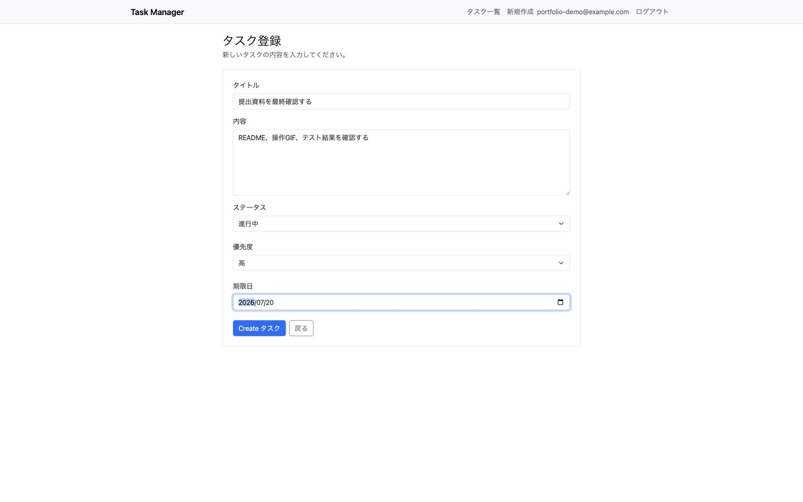
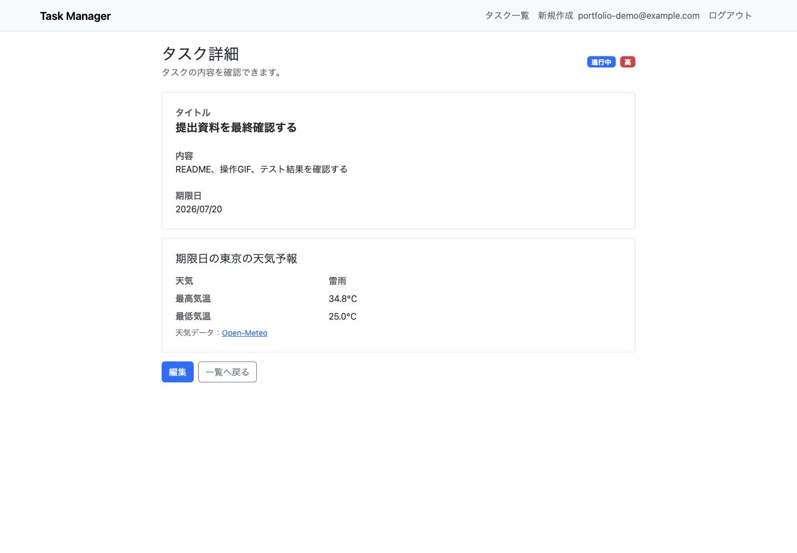
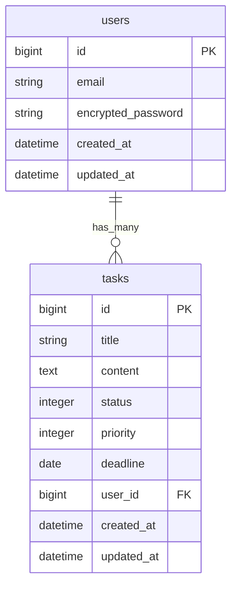
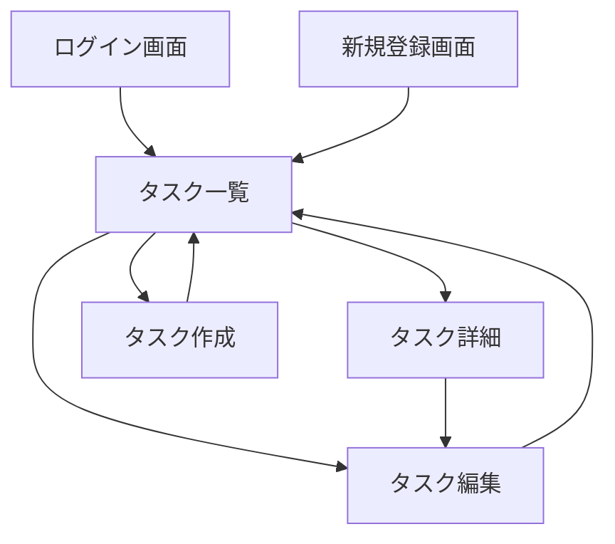

# Task Manager

タスクの状態・優先度・期限を一元管理できる、Ruby on Rails製のタスク管理アプリです。

[](https://github.com/ponjun4869/task_manager/actions/workflows/rspec.yml)

## 概要

ユーザーごとにタスクを管理し、作成・編集・削除・検索・並び替えを行えるWebアプリケーションです。
期限日の設定に加え、[Open-Meteo API](https://open-meteo.com/)と連携して、期限日の東京の天気予報をタスク詳細画面に表示します。

認証・データの所有者制御、外部APIの例外処理、RSpecによるモデル／リクエストテスト、GitHub Actionsによる自動テストまで実装しています。

## 制作背景

複数のタスクを「何から着手するか」「いつまでに終えるか」という観点で整理できるアプリを目指して制作しました。
単純なCRUDにとどまらず、認証、検索、ソート、外部API、テスト、CI、Docker環境まで段階的に実装し、Railsアプリ開発の一連の流れを学ぶことを目的としています。

## 操作デモ

公開URLを開かなくても主要な操作を確認できるよう、実際のアプリ画面をGIFにまとめています。
タスクの一覧表示、新規登録、登録結果、期限日の天気予報表示までを確認できます。



アプリケーションは、後述の[セットアップ手順](#セットアップ)を使ってローカル環境でも動作確認できます。

## 画面イメージ

### タスク一覧



### タスク登録



### タスク詳細・期限日の天気予報



## 主な機能

| 機能 | 内容 |
| --- | --- |
| ユーザー認証 | Deviseによる新規登録、ログイン、ログアウト |
| タスク管理 | タスクの作成、一覧、詳細、編集、削除 |
| ステータス管理 | 未着手、進行中、完了の3段階で管理 |
| 優先度管理 | 低、中、高の3段階で管理 |
| 期限管理 | タスクごとに期限日を設定・表示 |
| キーワード検索 | タイトルまたは内容から部分一致検索 |
| 並び替え | 新しい順、古い順、期限日が近い順、優先度が高い順 |
| 天気予報 | 期限日の東京の天気、最高気温、最低気温を表示 |
| ページネーション | 1ページ10件でタスク一覧を分割 |
| データ分離 | ログインユーザーが所有するタスクだけを操作可能 |

## 工夫した点

### 1. ユーザーごとのデータ分離

タスクの取得起点を常に `current_user.tasks` とし、URLを直接変更しても他ユーザーのタスクを閲覧・更新・削除できないようにしました。

```ruby
@task = current_user.tasks.find(params[:id])
```

この動作は[リクエストスペック](spec/requests/tasks_spec.rb)でも確認しています。

### 2. 安全な検索・並び替え

検索値はプレースホルダーを使ってSQLへ渡し、並び順は許可した値だけを `case` 文で適用しています。ユーザーから受け取った値を、そのままSQLの並び順に使用しない設計です。

期限日順では `NULLS LAST` を指定し、期限日未設定のタスクを一覧の最後に表示しています。

### 3. 外部API処理の分離とエラーハンドリング

Open-Meteo APIへの通信は[`WeatherForecastService`](app/services/weather_forecast_service.rb)に分離しました。コントローラーやビューへ通信処理を直接書かず、取得・JSON変換・期限日の抽出・天気コードの日本語変換をサービスクラスへまとめています。

API障害や通信エラーが発生した場合も、タスク詳細画面全体をエラーにせず、ユーザー向けメッセージを表示します。

```text
タスク詳細画面
    ↓ 期限日を渡す
WeatherForecastService
    ↓ HTTP GET
Open-Meteo API
```

### 4. テストと継続的インテグレーション

RSpecとFactoryBotを使用し、以下をテストしています。

- Taskモデルのバリデーション、初期値、表示用ラベル
- 未ログインユーザーのアクセス制御
- ログインユーザーごとのデータ分離
- タスクの作成、表示、更新、削除
- キーワード検索と並び替え
- 正常系と入力エラー時のレスポンス

[GitHub Actions](.github/workflows/rspec.yml)では、pushとPull Requestを契機にPostgreSQLを起動し、RSpec全体を自動実行します。

### 5. Dockerによる環境構築

Docker ComposeでRails、PostgreSQL、Adminerをまとめて起動できます。開発者ごとの環境差を抑え、データベースの内容もブラウザから確認できる構成にしています。

## 使用技術

| 分類 | 技術 |
| --- | --- |
| バックエンド | Ruby 3.3.0 / Ruby on Rails 7.1.6 |
| データベース | PostgreSQL 16 |
| フロントエンド | ERB / Bootstrap 5 / Sass / Hotwire |
| 認証 | Devise |
| 外部API | Open-Meteo Weather Forecast API |
| ページネーション | Kaminari |
| テスト | RSpec / FactoryBot |
| CI | GitHub Actions |
| 開発環境 | Docker / Docker Compose / Adminer |

## ER図



## 画面遷移図



## セットアップ

### Dockerを使う場合（推奨）

```bash
git clone https://github.com/ponjun4869/task_manager.git
cd task_manager
docker compose build
docker compose up
```

起動後、以下へアクセスします。

| 対象 | URL |
| --- | --- |
| Railsアプリ | http://localhost:3000 |
| Adminer | http://localhost:8080 |

初回起動時に `bin/rails db:prepare` が実行され、開発用データベースが作成されます。

終了する場合：

```bash
docker compose down
```

### ローカル環境で起動する場合

Ruby 3.3.0、PostgreSQL、Node.js、npmが必要です。

```bash
git clone https://github.com/ponjun4869/task_manager.git
cd task_manager
bundle install
npm install
bin/rails db:prepare
bin/dev
```

## テスト

RSpec全体を実行：

```bash
bundle exec rspec
```

リクエストスペックだけを実行：

```bash
bundle exec rspec spec/requests/tasks_spec.rb
```

現在、モデルスペックとリクエストスペックを合わせて25件のテストを実装しています。

## 今後の改善予定

- ユーザーが天気予報の対象地域を選べる機能
- 天気予報レスポンスのキャッシュによるAPI呼び出し回数の削減
- システムスペックによるブラウザ操作のテスト
- ステータス、優先度、期限による複合絞り込み
- UI/UXとレスポンシブ表示の改善
