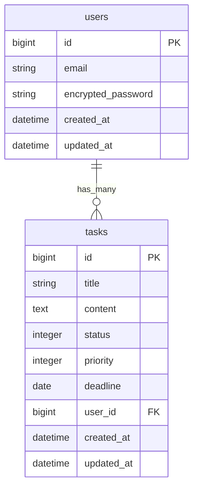
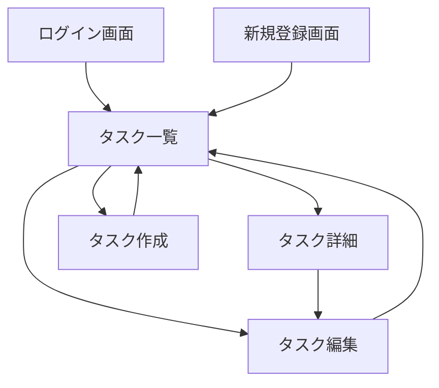

# Task Manager

Ruby on Railsで作成するタスク管理アプリです。  
ユーザーごとにタスクを管理し、タスクの作成・編集・削除・検索・ステータス管理・優先度管理を行えるWebアプリケーションです。

## URL

※ デプロイ後に記載予定

## 画面イメージ

### タスク一覧


## 使用技術

### Backend
- Ruby 3.3.0
- Ruby on Rails 7.1.6

### Database
- PostgreSQL

### Frontend
- Bootstrap 5
- Sass
- Hotwire（Turbo / Stimulus）

### Authentication
- Devise

### Pagination
- Kaminari

### Test
- RSpec
- FactoryBot

### Infrastructure
- Docker
- Docker Compose
- Adminer
- AWS（今後対応予定）

### Version Control
- Git
- GitHub

## 機能一覧

### 実装済み
- ユーザー登録
- ログイン / ログアウト
- タスク作成
- タスク一覧表示
- タスク詳細表示
- タスク編集
- タスク削除
- タスク検索
- ステータス管理（未着手 / 進行中 / 完了）
- 優先度管理（低 / 中 / 高）
- ページネーション
- ユーザーごとのタスク管理
- Dockerによる開発環境構築
- AdminerによるPostgreSQLの可視化
- RSpecによるモデルテスト

## ER図



## 画面遷移図



## セットアップ方法

### Dockerを使う場合

このアプリはDockerを使って、Rails、PostgreSQL、Adminerをまとめて起動できます。

```bash
docker compose build
```

```bash
docker compose up
```

起動後、Railsアプリにアクセスします。

```text
http://localhost:3000
```

PostgreSQLの中身を確認したい場合は、Adminerにアクセスします。

```text
http://localhost:8080
```

Adminerのログイン情報は以下です。

```text
システム: PostgreSQL
サーバ: db
ユーザ名: postgres
パスワード: password
データベース: task_manager_development
```

初回起動時は、`docker-compose.yml` の設定により `bin/rails db:prepare` が実行されます。  
そのため、データベース作成とマイグレーションは自動で行われます。

コンテナを停止する場合は、以下のコマンドを実行します。

```bash
docker compose down
```

### ローカル環境で起動する場合

Ruby、PostgreSQL、Node.js、npmをローカルに用意している場合は、以下の手順で起動できます。

```bash
bundle install
```

```bash
npm install
```

```bash
bin/rails db:prepare
```

```bash
bin/dev
```

## テスト

RSpecを使ってモデルテストを実行できます。

```bash
bundle exec rspec
```

特定のテストファイルだけ実行する場合は、以下のように指定します。

```bash
bundle exec rspec spec/models/task_spec.rb
```

## 開発目的

Web系エンジニアへの転職を目指し、ポートフォリオ用にRails・PostgreSQL・Docker・GitHubを用いた実務に近い開発フローを学習するために作成しています。

## 今後の改善予定

- AWSデプロイ
- 期限管理
- ソート機能
- RSpecによるテスト拡充
- UI/UXの改善
